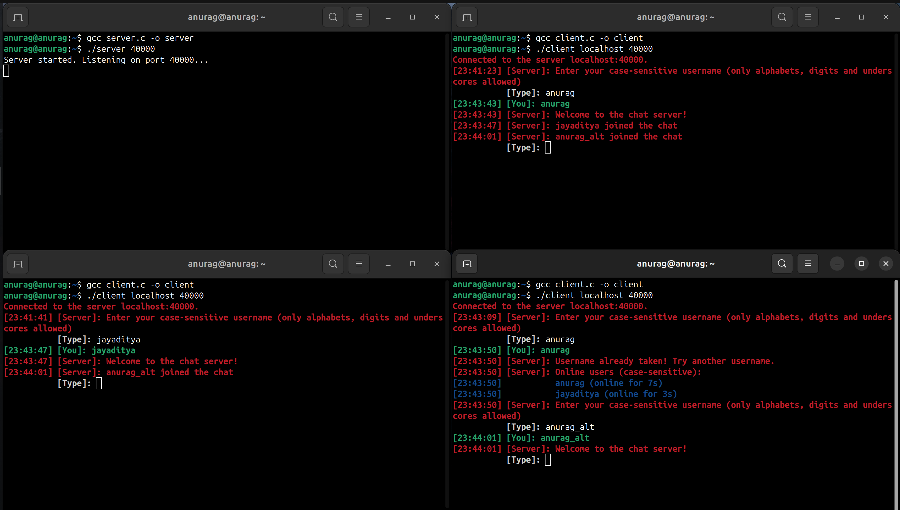
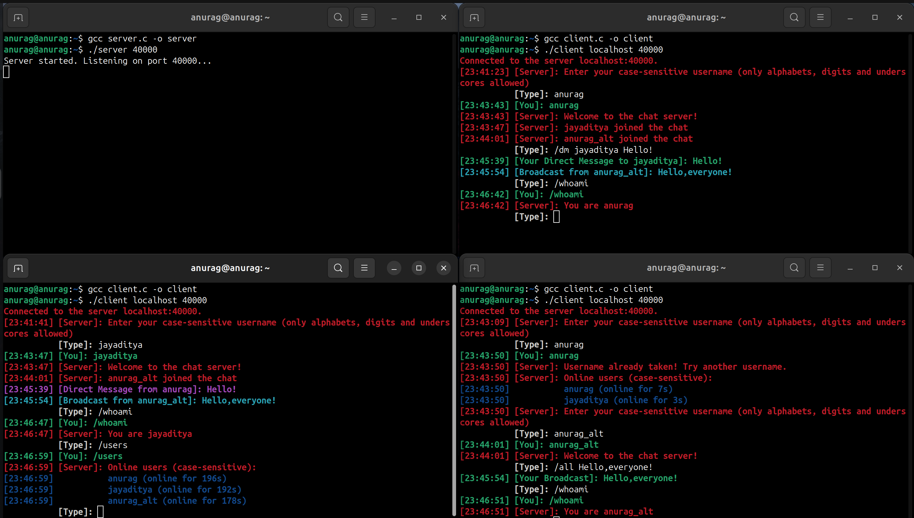
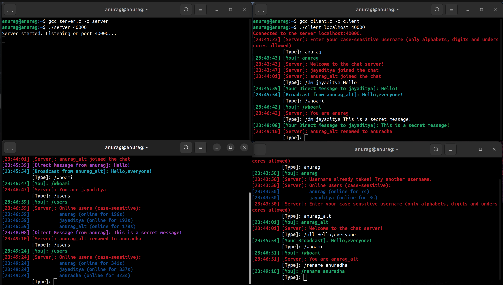
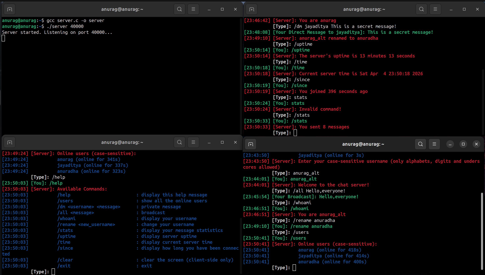
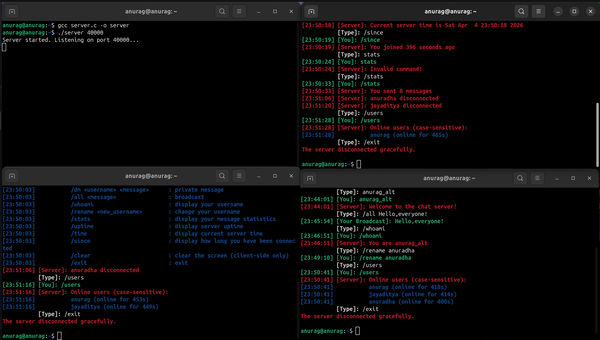

Multi-Threaded TCP Server and Client

## Author
Anurag Mishra ([@anuragmishra-creates](https://github.com/anuragmishra-creates))

--- 
## Project Overview
The system follows a thread-per-client architecture where each connection is handled independently while sharing synchronized access to global client state.

This project implements a robust, concurrent Client-Server chat application using TCP sockets in C. It utilizes POSIX threads (`pthreads`) to handle multiple simultaneous client connections and non-blocking I/O paradigms. The architecture supports real-time broadcasting, private messaging, dynamic user management, and seamless terminal-based interaction.

---

## 🛠️ Instructions to Compile and Run

### Prerequisites
* A Linux/POSIX-compliant environment.
* GCC compiler installed.

### Compilation
Open your terminal and compile the server and client codes.

```bash
gcc server.c -o server
gcc client.c -o client
```

### Execution

#### 1. Start the Server

Run the server executable and provide a port number of your choice (e.g., `40000`):

```bash
    ./server 40000
```

#### 2. Start the Clients

Open a new terminal window (or a different VM) for each client.  
Run the client executable with the server's IP address and port number.

```bash
    ./client localhost 40000
```

---

## 🌟 Core Functionalities (As per Lab Requirements)

- **Concurrent Client Handling:**  
  The server utilizes `pthread_create` to spawn a detached thread for every incoming client connection, allowing multiple clients to interact simultaneously without blocking the main server process.

- **Dynamic Join/Disconnect:**  
  Clients can join the chat dynamically. The server manages a dynamic array of active clients (up to 100) and automatically reclaims slots when clients disconnect (gracefully or abruptly).

- **Private Messaging:**  
  Two clients can chat privately via the server using private messaging logic.

- **Network Broadcasting:**  
  Clients can broadcast messages to all currently active users on the server using the `/all` command.

--- 

## 🚀 Advanced & Additional Functionalities

We went above and beyond the standard requirements to create a highly polished, production-like terminal chat experience.

### 1. Seamless Concurrent Terminal I/O (Bypassing Canonical Mode)

#### The Problem
Standard C input functions like `fgets()` rely on OS-level line buffering. This causes incoming server messages to overwrite the user's partially typed input.

#### Our Solution
We implemented low-level terminal control using `<termios.h>`:

- Disabled **Canonical Mode** and **ECHO**
- Captured raw character input using `read()`
- Maintained a local input buffer
- Reprinted:
  - Prompt
  - User’s unfinished input
  whenever an asynchronous message arrives

This ensures a smooth, uninterrupted typing experience.

---

### 2. Robust User Authentication & Session Management

#### Features

- **Unique Username Enforcement**
  - Case-sensitive
  - Alphanumeric + underscores allowed
  - Duplicate and invalid usernames rejected

- **Dynamic Renaming**
  - Command: `/rename`
  - Updates server registry in real-time
  - Broadcasts change to all users

- **Session Tracking**
  - Stores join timestamp (`time_t`)
  - Tracks total messages per user

---

### 3. Interactive Command-Line Interface (CLI)

#### Supported Commands

| Command | Description |
|--------|------------|
| `/help` | Displays help menu |
| `/users` | Lists active users + session duration |
| `/dm <username> <message>` | Sends private message |
| `/all <message>` | Broadcast message |
| `/whoami` | Shows current username |
| `/stats` | Displays total messages sent |
| `/uptime` | Shows server uptime (D:H:M:S) |
| `/time` | Returns server timestamp (`ctime_r`) |
| `/since` | Shows session duration |
| `/clear` | Clears terminal using ANSI codes |
| `/exit` | Graceful disconnect |

---

### 4. Advanced UI/UX Formatting

#### Features

- **Color-Coded Output (ANSI Escape Codes)**

  | Type | Color |
  |------|------|
  | Server Alerts | Red |
  | Broadcast Messages | Cyan |
  | Direct Messages | Magenta |
  | Menus | Blue |
  | Outgoing Messages | Green |

- **Audio Alerts**
  - Terminal bell (`\a`) on new messages

- **Real-Time Timestamps**
  - Format: `[HH:MM:SS]`
  - Uses `localtime_r` (thread-safe)

---

### 5. Resilient Error Handling

#### Stability Enhancements

- **SIGPIPE Immunity**
  - Server ignores `SIGPIPE`
  - Prevents crashes on broken sockets

- **Non-Blocking Safety**
  - Gracefully handles:
    - `EINTR`
    - `EAGAIN`
    - `EWOULDBLOCK`
  - Prevents I/O deadlocks and freezes

---

## 💡 Summary

This system is not just a basic chat application — it mimics an **advanced terminal messaging system** with:

- Smooth real-time interaction
- Robust fault tolerance
- Clean and responsive UI/UX

---

## 📸 Preview

### SS1: 


### SS2:


### SS3:


### SS4:


### SS5:


---